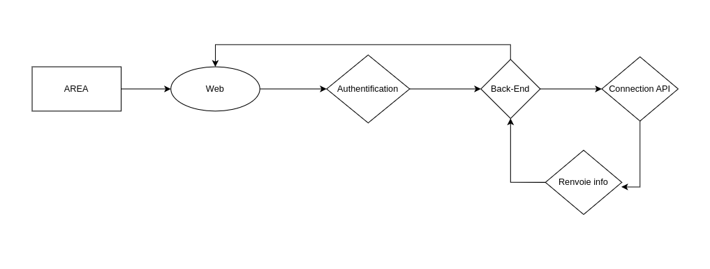
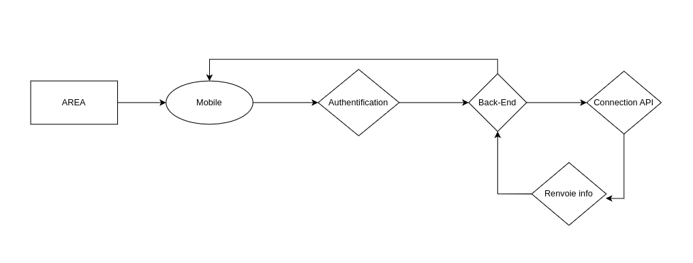

Architecture
=============

Le projet AREA est structurer en 3 partie:

    - Le back-end
    - le front-web
    - le front mobile

back-end
---------

Le back-end est Architecturer de la manière suivante :

.. image:: images/back-end.png
    :width: 400
    :alt: Alternative text

Front-web
---------

front web:

Front mobile
------------

front mobile:

