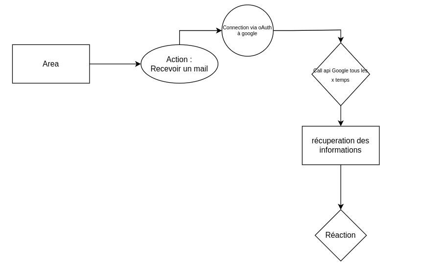
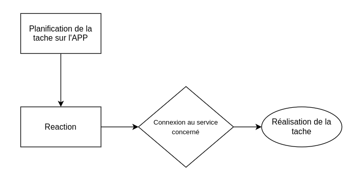

Details
========

The project is composed of several parts useful for the good functioning of the project.

Authentification
-----------------

We have set up an authentication system on our project.
To do so, the person must only fill in a username and a password.

This information is stored in the database and each user is associated with a token.

This allows us to customize the actions according to the user.

.. _service:

Services
---------

:doc:`api`

.. _action:

Action 
-------

One of the most important components of the project is the Actions.
The latter is a task carried out on a service according to instructions determined upstream.

Here is a diagram explaining in a broad way the functioning:

To do this a connection to the service is required for operation see attached for more information: :ref:`service`

Some key points to understand the component.

First of all the Action component is linked to a trigger defined upstream to guide the action to be taken.
Without a trigger it wouldn't know what to do.

So triggers have been defined for each action and reaction.
An example of a trigger :
    
    Connection to gmail
    
    check every x time if we have received a mail
    
    storage of the mail information.

To manage all services we use a variable call

.. code-block:: go

    var Google = google.New()
    var Microsoft = Microsoft.New()

For example for the connection to google we will ask for an authentication to the service

.. code-block:: go

    func (*googleService) Authenticate(callback string, userId uint) string {
	var state types.OauthState

	state.Callback = callback
	state.UserId = userId

	conf := &oauth2.Config{
		ClientID:     os.Getenv("GOOGLE_CLIENT_ID"),
		ClientSecret: os.Getenv("GOOGLE_CLIENT_SECRET"),
		RedirectURL:  os.Getenv("OAUTH_REDIRECT_URL") + "/providers/google/callback",
		Scopes: []string{
			"https://www.googleapis.com/auth/gmail.readonly",
		},
		Endpoint: google.Endpoint,
	}
	bytes, _ := json.Marshal(state)
	str := base64.RawStdEncoding.EncodeToString(bytes)
	return conf.AuthCodeURL(str, oauth2.AccessTypeOffline, oauth2.ApprovalForce)
    }

we recover the id and the secret of the client to be able to interact with the google service for the action.

When the access to the service is good, we will ask it to do an action that we have defined as follows:

.. code-block:: go
    
    func (*googleService) Check(action string, trigger models.Trigger) bool {
	var srv = createGoogleConnection(trigger.User.GoogleToken)
	if srv == nil {
		return false
	}
	switch action {
	case "receive":
		return checkGmailReceive(srv, trigger.ID, trigger.UserID)
	case "send":
		return checkGmailSend(srv, trigger.ID, trigger.UserID)
	}
	return false
    }

In our case, we can observe that we perform tasks regarding the sending and receiving of mail.
to realize a reaction according to this action we will for example store the information of the mail

so we will get the information 

.. code-block:: go
    
    func fetchLastGmailReceive(srv *gmail.Service) *gmail.Message {
	res, err := srv.Users.Messages.List("me").Q("label:Inbox").Do()
	if err != nil {
		lib.LogError(err)
		return nil
	}

	id := res.Messages[0].Id
	res2, err := srv.Users.Messages.Get("me", id).Do()
	lib.LogError(err)
	return res2
    }   

This action has been completed, so let's move on to the reaction.

.. _reaction:

Reaction
---------

The reaction is the continuation of an action that we have carried out upstream.
For example, the reaction action is to check if a mail has been sent and then send us a message on discord

To understand the logic here is a diagram:

We have seen before the mail reception check on gmail.

Now the reaction of this action on discord. To do this you need to authenticate on discord
and then perform the "send" action. This translates like this:

.. code-block:: go

    func (*discordService) React(reaction string, trigger models.Trigger) {
	var storedData models.TriggerData
	var buf bytes.Buffer

	buf.Write(trigger.Data)
	err := gob.NewDecoder(&buf).Decode(&storedData)
	lib.LogError(err)

	switch reaction {
	case "send":
		sendMessage(storedData, trigger.Action, trigger.ActionService)
	}

In this case we give him the instruction to send a message to discord.
to do this in the case of discord we are allowed to use a webhook. if not it is not allowed.

so here is the example with a webhook :

.. code-block:: go

    func sendMessage(storedData models.TriggerData, action string, service string) {
	var username = "Area"
	var title = "New " + string(action) + " in " + string(service)
	var color = "1668818"
	var embeds []discordwebhook.Embed
	var fields []discordwebhook.Field
	var timestamp = storedData.Timestamp.Format("January 2, 2006") + " at " + storedData.Timestamp.Format("15:04:05")
	var footer discordwebhook.Footer = discordwebhook.Footer{
		Text: &timestamp,
	}

	url := storedData.ReactionData

	fields = append(fields, discordwebhook.Field{
		Name:  &storedData.Title,
		Value: &storedData.Description,
	})
	embeds = append(embeds, discordwebhook.Embed{
		Title:       &title,
		Description: &storedData.Author,
		Fields:      &fields,
		Color:       &color,
		Footer:      &footer,
	})
	message := discordwebhook.Message{
		Username: &username,
		Embeds:   &embeds,
	}
	err := discordwebhook.SendMessage(url, message)
	lib.LogError(err)
}

But in a large majority for example for .... we do as below:

.. code-block:: go
    
	func (jobsManager) Do() {
	var triggered bool
	triggers, err := database.Trigger.GetActive()
	lib.LogError(err)

	for _, v := range triggers {
		switch v.ActionService {
		case "google":
			triggered = services.Google.Check(v.Action, v)
		case "microsoft":
			triggered = services.Microsoft.Check(v.Action, v)
		case "github":
			triggered = services.Github.Check(v.Action, v)
		case "notion":
			triggered = services.Notion.Check(v.Action, v)
		case "discord":
			triggered = services.Discord.Check(v.Action, v)
		default:
			triggered = false
		}
		if triggered {
			updated, _ := database.Trigger.GetById(v.ID, v.UserID)
			switch v.ReactionService {
			case "google":
				services.Google.React(v.Reaction, *updated)
			case "microsoft":
				services.Microsoft.React(v.Reaction, *updated)
			case "github":
				services.Github.Check(v.Reaction, *updated)
			case "notion":
				services.Notion.React(v.Reaction, *updated)
			case "discord":
				services.Discord.React(v.Reaction, *updated)
			}
		}
	}
	}